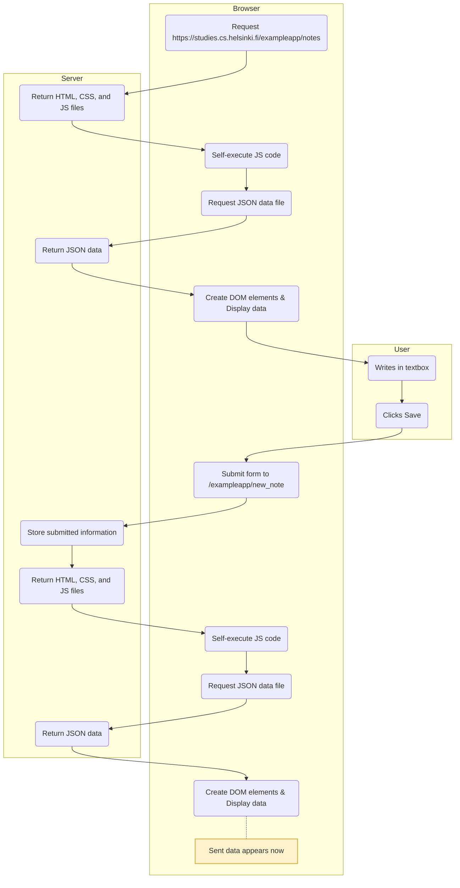

<h2 align="center">New Note Flowchart</h2>

```mermaid

flowchart TD
    subgraph User
        U1(Writes in textbox)
        U2(Clicks Save)
        U1 --> U2
    end

    subgraph Browser
        B1(Request https://studies.cs.helsinki.fi/exampleapp/notes)
        B2(Self-execute JS code)
        B3(Request JSON data file)
        B4(Create DOM elements & Display data)
        B5(Submit form to /exampleapp/new_note)
        B6(Self-execute JS code)
        B7(Request JSON data file)
        B8(Create DOM elements & Display data)
        Note1[Sent data appears now]
        B8 -.- Note1
        style Note1 fill:#fff2cc,stroke:#d6b656,stroke-width:2px,color:#333
    end

    subgraph Server
        S1(Return HTML, CSS, and JS files)
        S2(Return JSON data)
        S3(Store submitted information)
        S4(Return HTML, CSS, and JS files)
        S5(Return JSON data)
    end

    B1 --> S1
    S1 --> B2
    B2 --> B3
    B3 --> S2
    S2 --> B4
    B4 --> U1
    U2 --> B5
    B5 --> S3
    S3 --> S4
    S4 --> B6
    B6 --> B7
    B7 --> S5
    S5 --> B8
```